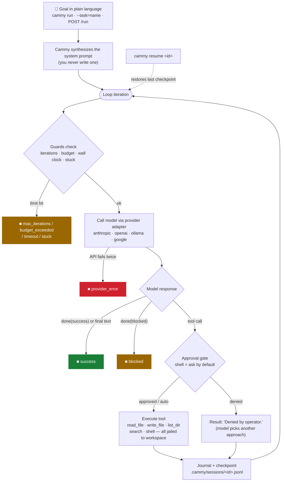

# Cammy 🔁

**The open-source agentic loop harness for developers.** Goal in, working code out — no prompt engineering required.

MIT licensed · Node 18+ · zero dependencies · single file

Cammy wraps the entire plan → act → observe agent loop so you don't have to: it synthesizes the system prompt, executes tools, retries failed model calls, detects stuck loops, enforces budget / iteration / wall-clock guardrails, gates dangerous actions behind human approval, and journals every event to resumable JSONL sessions.

📖 **Full documentation:** [DOCS.md](./DOCS.md)

## Install

```bash
npm i -g cammy        # or run directly: node cammy.mjs
```

## Quickstart

```bash
export ANTHROPIC_API_KEY=sk-...   # or OPENAI_API_KEY
cammy init
cammy run "fix the failing tests and make CI green"
cammy serve                       # dashboard backend on :7433
```

## Commands

| Command | What it does |
|---|---|
| `cammy init` | Scaffold `cammy.json` config and `.cammy/` session dir |
| `cammy run "<goal>"` | Run the agent loop on a goal (`--yes`, `--max=N`, `--model=`, `--provider=`, `--task=`) |
| `cammy resume <id>` | Continue an interrupted session from its last checkpoint |
| `cammy sessions` | List past session journals |
| `cammy serve` | Start the local API + SSE event stream for the dashboard UI |

## Guardrails

Every run is bounded by four independent guards: max iterations, dollar budget, wall-clock timeout, and identical-action stuck detection. Shell access requires human approval by default (`--yes` to bypass). All file operations are jailed to the workspace directory.

## Providers

Anthropic (native), OpenAI, and Ollama (via the OpenAI-compatible adapter) — switch with one line in `cammy.json`:

```json
{ "provider": "ollama", "model": "llama3.1", "baseUrl": "http://localhost:11434" }
```

## Dashboard UI

The `ui/` folder contains a React dashboard (Tailwind + framer-motion + lucide-react) that streams live loop events from `cammy serve` over SSE at `localhost:7433`, with guardrail meters and in-browser approval gates.

## How it works



Every box on the right edge is a terminal state you'll see in the final `■` line
and in the `session_end` journal event. The loop is fully auditable: every tool
call, result, and approval decision hits the journal before the next iteration.

## License

MIT — see [LICENSE](./LICENSE).
